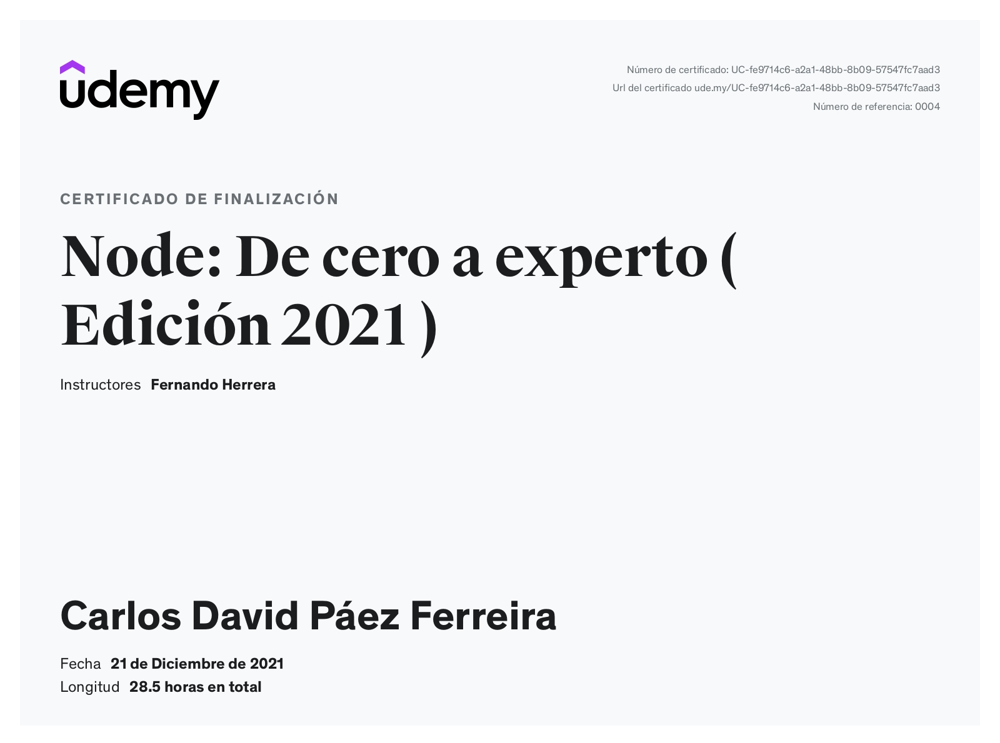

# Curso Node: De cero a experto ( Edición 2021 )

Curso impartido por [Fernando Herrera - Udemy](https://www.udemy.com/user/550c38655ec11/) en la plataforma de UDEMY. En su página oficial se encuentras cupones de descuento para sus cursos: [Fernando Herrera - Página Web](https://fernando-herrera.com/#/home)

## Instalaciones necesarias o recomendadas

Algunas de las instalaciones recomendadas para el curso son las siguientes: ([Documento con enlaces](https://gist.github.com/Klerith/177c153db77e566cb763f79e65d248bf))

- Google Chrome
- Visual Studio Code
- Postman
- Mongo Compass
- Git
- Github
- Node

## Certificado de finalización del curso

